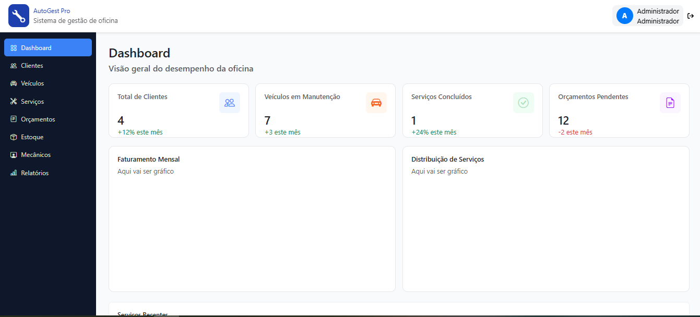
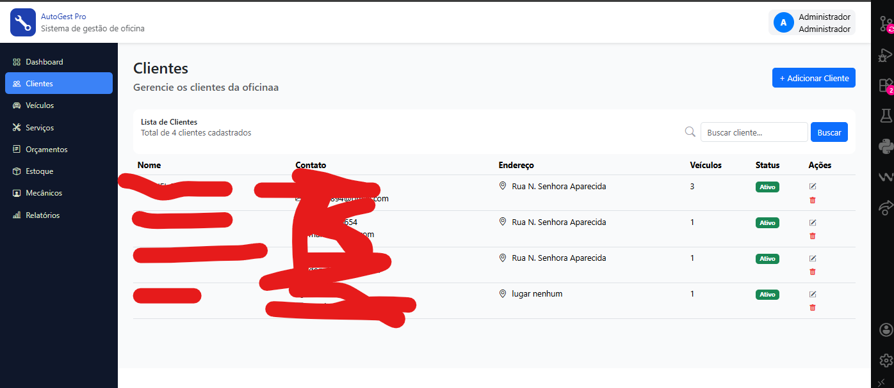
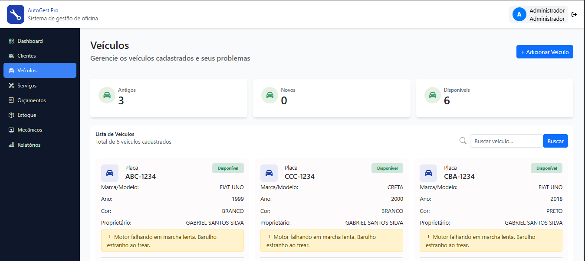
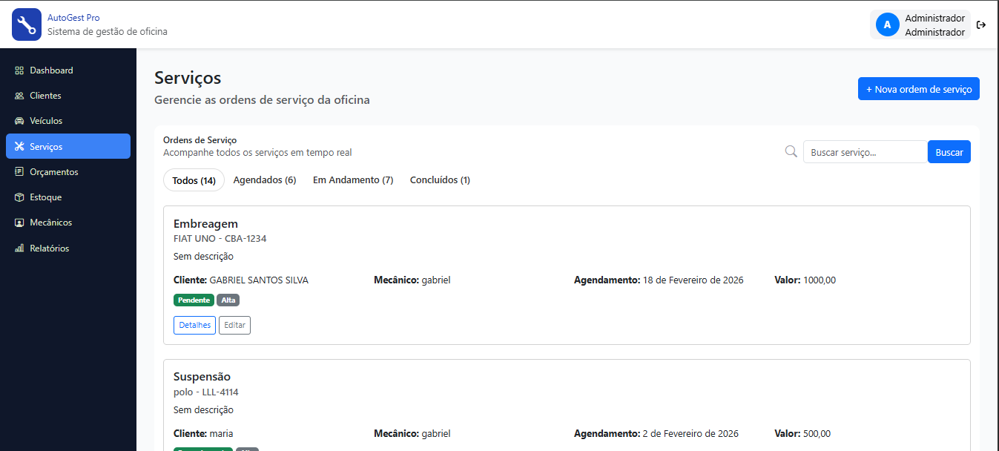

# Sistema de Gerenciamento de Oficina

Este é um sistema desenvolvido pela nossa equipe com o objetivo de simular e organizar o dia a dia de uma oficina mecânica, contemplando tarefas comuns como cadastro de veículos e clientes, registro de serviços e consulta rápida de informações importantes para o atendimento. A proposta foi criar uma solução simples, funcional e próxima da realidade, ajudando a substituir controles informais por um sistema estruturado e de fácil utilização.

O desenvolvimento foi realizado utilizando o framework Django, permitindo a construção de uma aplicação web completa, integrando backend, frontend e requisições AJAX para tornar a navegação mais dinâmica e eficiente. Além de atender a uma proposta prática, o projeto também serviu como experiência real de desenvolvimento em equipe, aplicando conceitos de organização de código, separação de responsabilidades e estruturação de sistemas web.

---
## Demonstração do Sistema

### Tela inicial

### Pagina cliente

### Pagina veículos

### Pagina de serviços

## Tecnologias utilizadas no projeto

Python e Django como base do sistema, banco SQLite com possibilidade de mudança, HTML, CSS e JavaScript pra interface e algumas interações usando AJAX pra carregar informações sem precisar recarregar a página toda.

---

## Como rodar o projeto na sua máquina

Primeiro você precisa clonar o repositório:

git clone https://github.com/DanMonteVerde/Gerenciador-de-oficina.git

Depois entra na pasta do projeto:

cd oficina

Se quiser fazer do jeito mais organizado, cria um ambiente virtual:

python -m venv venv

Ativa o ambiente virtual:

Windows:
venv\Scripts\activate

Linux ou Mac:
source venv/bin/activate

Instala as dependências:

pip install -r requirements.txt

Aplica as migrações do banco:

python manage.py migrate

E finalmente roda o servidor:

python manage.py runserver

Depois disso é só acessar no navegador:
http://127.0.0.1:8000/

---

## O que o sistema consegue fazer hoje

O sistema permite realizar o CRUD (criar, consultar, atualizar e excluir) de veículos, clientes e serviços. Também possibilita registrar serviços executados, consultar informações específicas por meio de requisições AJAX e acompanhar os atendimentos de forma organizada dentro da plataforma. A proposta foi reproduzir um fluxo simples, porém funcional, baseado nas rotinas reais de uma oficina mecânica.

---

## Organização geral do projeto

A pasta oficina concentra as configurações principais do projeto Django. Já servicos, veiculos, main, clientes e account são os chamados apps, usados para organizar o sistema em partes menores, facilitando a manutenção, a leitura do código e a separação da lógica.

Dentro de cada app existe uma estrutura padrão: os arquivos com o nome de models.py definem a estrutura do banco de dados e fazem ligação com o mesmo, com o nome de views.py concentram a lógica do sistema e fazem a comunicação com os templates (HTML), e os urls.py define as rotas e caminhos de acesso. A pasta templates armazena as páginas HTML do sistema, enquanto a pasta static reúne arquivos estáticos como CSS, JavaScript e imagens usados na interface.
---

## Desenvolvedores

Gabriel Santos

Kayke Lopes

Daniel Barbosa

Everton Martins

Estudantes do Ensino Médio Técnico em Informática Integrado  – IF Baiano Campus Bom Jesus da Lapa
